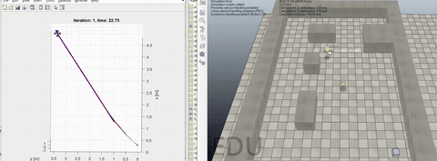

# Quadrotor Trajectory Tracking with Artificial Potential Fields

**A full 6-DOF quadrotor model with PD control tracks a dynamic target through APF-planned, obstacle-avoiding trajectories.**

📄 [**Report — view in browser**](https://docs.google.com/viewer?url=https%3A%2F%2Fraw.githubusercontent.com%2FLokesh97Bansal%2FQuadrotor-Path-Planning-using-Artificial-Potential-Field-Approach%2Fmain%2FReport.pdf) · 🎞 [**Slides — view in browser**](https://docs.google.com/viewer?url=https%3A%2F%2Fraw.githubusercontent.com%2FLokesh97Bansal%2FQuadrotor-Path-Planning-using-Artificial-Potential-Field-Approach%2Fmain%2FPPT.pdf) · 🎬 [Full-quality video (MP4)](./APF.mp4)

## Overview
This project closes the loop from planning to control: an **artificial potential field (APF)** generates a trajectory that follows a dynamic target while avoiding static obstacles, and a **6-DOF quadrotor model with a PD controller** tracks that trajectory in simulation.

## Method
- APF planner: attractive potential toward the moving target, repulsive potentials around static obstacles.
- Full 6-DOF quadrotor dynamics model with PD trajectory-tracking control.

## Context
Graduate research project, Robotics & Autonomous Systems, **IISc Bengaluru** (Aug–Dec 2021).
